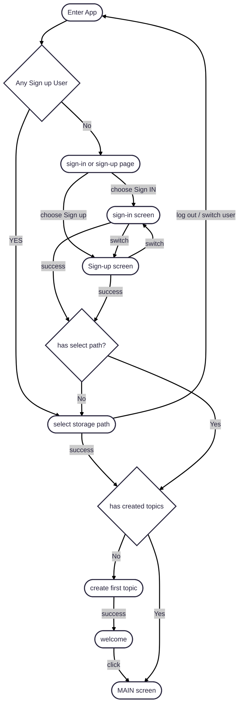

# 初始化问题

我想问下 Android jetpack compose 应用初始化问题：
我现在有一个基于 IM 的 记录 app，初始化的时候，需要
1. 让用户创建 user / 登录已创建的 user
2. 让用户选择信息文件保存的路径
3. 如果 Topic 为空，创建一个初始化的 Topic
   这些操作，一般都是怎么做呢？最佳实践是什么？

## Gemini 3.5 flash

在 Android Jetpack Compose 应用中，此类初始化流程（通常称为 Onboarding（引导）流程）是非常常见的。合理的架构设计能够确保用户体验顺畅，同时保证数据的安全与一致性。
以下是实现这一流程的常见设计模式和推荐做法。

1. 整体架构设计

   推荐采用**状态驱动（State-driven）**的架构。通过一个全局的状态（通常保存在 DataStore 中）来记录初始化的进度，并根据该状态决定应用的导航路由。
   
   1. 初始化状态定义
      可以使用 DataStore (Preferences DataStore) 来存储当前用户的配置状态：
      userId: 当前登录/创建的用户 ID（若为空，说明未登录/创建）。
      storagePath: 用户选择的文件保存路径（若为空，说明未配置路径）。
      isInitialized: 一个布尔值，表示是否完成了所有初始化操作（包括默认 Topic 的创建）。
      
   2. 状态流向图

      ```Text
      [启动应用] ──> [读取 DataStore 状态]
      │
      ├─> 如果无用户 ──> 导航到 [登录/注册页面]
      ├─> 如果无路径 ──> 导航到 [路径选择页面]
      ├─> 如果未完成初始化 ──> 后台创建默认 Topic ──> 标记完成
      └─> 如果全部完成 ──> 导航到 [主界面]
      ```
      
2. 具体步骤的推荐实现方式

   步骤 1：用户创建与登录

   界面实现：使用 Compose 编写一个简单的登录/注册页面。
   业务逻辑：

      在 ViewModel 中处理登录/注册逻辑。
      成功后，将生成的 userId 或 token 写入 DataStore。
      此时，Compose 中的 collectAsState 会感知到状态变化，导航组件（Navigation）据此跳转到下一步。

   步骤 2：选择信息文件保存路径
      
      在 Android 10 及以上版本中，推荐使用 存储访问框架 (Storage Access Framework, SAF)，以便用户选择一个目录来存储应用的数据。

   步骤 3：创建初始化的 Topic

      当步骤 1 和 步骤 2 完成后，可以开始初始化数据库并创建默认 Topic。

      触发时机：当检测到 userId 和 storagePath 均已准备就绪，但 isInitialized 为 false 时触发。
      具体做法：
      在后台协程中（可以使用 WorkManager 或在 ViewModel 的 viewModelScope 中）执行。
      根据步骤 2 获取的路径，初始化你的数据库。
      查询数据库中是否存在 Topic。如果为空，插入一条默认数据（例如：“我的随笔” 或 “默认主题”）。
      插入成功后，将 isInitialized 标记为 true 写入 DataStore。

3. 导航（Navigation）的最佳实践
   在 Jetpack Compose 中，建议使用 Compose Navigation。为了避免用户在进入主界面后，通过系统的“返回键”重新回到初始化页面，需要合理管理返回栈（Back Stack）。

   可以使用条件导航（Conditional Navigation）来控制首屏：

   ```Kotlin
   @Composable
   fun AppNavigation(
   navController: NavHostController,
   authState: AuthState // 从 ViewModel 获取的初始化状态
   ) {
   val startDestination = when {
   !authState.isLoggedIn -> "login"
   !authState.isPathSelected -> "storage_setup"
   !authState.isInitialized -> "initializing"
   else -> "main"
   }

   NavHost(navController = navController, startDestination = startDestination) {
   composable("login") {
   LoginScreen(onLoginSuccess = {
   // 导航到路径选择，并清空登录页的返回栈
   navController.navigate("storage_setup") {
   popUpTo("login") { inclusive = true }
   }
   })
   }
   composable("storage_setup") {
   StorageSetupScreen(onPathSelected = {
   navController.navigate("initializing") {
   popUpTo("storage_setup") { inclusive = true }
   }
   })
   }
   composable("initializing") {
   // 显示一个加载动画，在后台执行 Topic 创建
   InitializationScreen(onComplete = {
   navController.navigate("main") {
   popUpTo("initializing") { inclusive = true }
   }
   })
   }
   composable("main") {
   MainScreen()
   }
   }
   }
   ```

4. 关键注意事项
   
   生命周期与异步操作：
   数据库初始化和默认数据的写入（步骤3）是 I/O 密集型操作，请务必在非 UI 线程（如 Dispatchers.IO）中执行，避免界面卡顿。
   错误处理：
   如果用户在选择路径后，手动删除了该文件夹，应用应该如何应对？
   建议在应用每次启动（通常在 Splash 页面或应用入口处）检查路径的可用性（使用 DocumentFile.fromTreeUri 检查）。如果失效，需要引导用户重新选择。
   依赖注入 (DI)：
   如果使用 Hilt，由于数据库路径是动态选择的，你可能无法在应用启动时立即提供一个单例的 Database 实例。可以考虑使用一个工厂类或者**延迟初始化（Lazy）**的方式来生成数据库实例。


## DeepSeek

在启动阶段基于 UserData 的状态来进入不同的页面；所有 ready 了再进入主页。
也就是说，没有把 onboarding 步骤打平放到 navhost 里面。

```
@Composable
fun AppInitGate(appInitViewModel: AppInitViewModel = hiltViewModel()) {
    val initState by appInitViewModel.initState.collectAsStateWithLifecycle()

    AnimatedContent(targetState = initState) { state ->
        when (state) {
            InitState.Loading -> LoadingScreen()
            InitState.NeedLogin -> LoginScreen(...)
            InitState.Ready -> MainScreen()
            // ...
        }
    }
}
```

Gemini 评价这个比较先进，称为 `混合架构（Hybrid Approach）`.

因为放到 navhost 里，一方面要处理各种返回栈的移除；另一方面 viewModel 会持续保留登录的信息，导致不必要的状态保存到内存里；

也就是说，这些流程本身和 main 是无关的，在外层分流比较好（是不是也就是类似不同的 activity）

在一个 screen 内部，可以再进行 navhost 来处理返回、导航。

## 我们要处理的流程





NOTE:
1. 暂时不必再在 topic 创建页面给出修改存储位置的 nav；它不重要，没必要事事具备，反而引入太多的歧义


STATE:

- LOADING -> splash screen
- SIGN in / SIGN up -> Sign-in/Sign-up Screen
- SELECT_STORAGE_PATH -> select storage screen
- CREATE_FIRST_TOPIC -> create first topic screen
- WELCOME -> welcome screen
- MAIN -> main screen

<del>
datastore 数据： 
1. users
   1. all-users [list]
   2. current user [string]
2. user -> storage-path [string]
3. user -> has-created-first-topic [boolean]
4. user -> has-shown-welcome [boolean]

</del>

xxxx <-- Deepseek 说 datastore 不适合存复杂数据；里面就存一个 current-user-id, 其他的都放到数据库就行！ SqlDelight 读取很快的！

更正后：

- datastore 数据： current-user-id
- SqlDelight 数据：
   Table: DeviceUsers

   - id TEXT (和 users 表对应)
   - media_file_storage_root_uri TEXT
   - has-created-first-topic INT (boolean)
   - has-shown-welcome INT (boolean)


## 更新：不让用户参与不必要的初始化流程

SIGN_IN: 不让用户再输入用户名、avatar => 给一个随机值

CREATE_FIRST_TOPIC: 直接给一个随机值

【intro】

大航海时代，水手抛下原木，测量未知的海域；
数字时代，你发出一条消息，标记此刻的坐标。

大航海时代，水手抛下原木，标记航程与未知；
数字时代，你发出一条消息，标记此刻与世界。

ImLog

【ACCOUNT】

- 有账户
  选择一个账户继续标记

- 无账户
  现在将为你创建一个角色
  xxx
  <继续>


【STORAGE】

你的消息只属于你，
选择一个喜欢的地方来存储它们

【Topic】
将为你创建第一个消息主题，你可以创建更多
xxx
<完成>

【welcome】
标记此刻、回溯过往
I'm Logging


## 更新2：感觉展示出用户的的信息+topic其实也毫无意义，那并不是重点

onboarding 进入条件：init state 不是 FINISHED


【Account】

进入条件：无 current user
- 有登录过的用户：展示 select 界面
- 无登录过的用户： 展示 intro，后台创建 user

  - intro
   大航海时代，水手抛下原木，测量未知的海域；
   数字时代，你发出一条消息，标记此刻的坐标。

   大航海时代，水手抛下原木，标记航程与未知；
   数字时代，你发出一条消息，标记此刻与世界。

   ImLog

【Storage】

进入条件：已有 current-user
- 但未选中 storage

副作用：
- 写入一个标识文件
- 设置 storage uri
- 设置 storage flag

【Welcome】

进入条件：已有 current-user, storage 选中，但 welcome-shown 为false
副作用：
1. 如果无 topic, 建立第一个 topic
2. 设置 welcome-shown = true

UI：
- 显示已创建用户、已创建 topic
- 显示欢迎使用